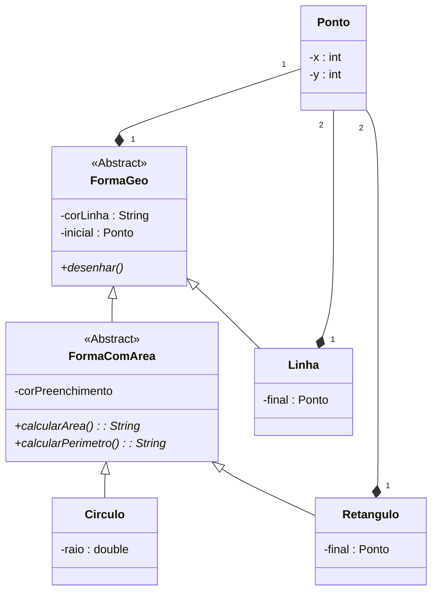

```mermaid
classDiagram
    direction BT
    class FormaGeo{
        <<Abstract>>
        -corLinha : String
        -inicial : Ponto
        +desenhar()*
    }
    
    class Ponto{
        -x : int 
        -y : int
    }
    
    class FormaComArea{ 
        <<Abstract>>
        -corPreenchimento
        +calcularArea()* : String
        +calcularPerimetro()* : String
    }
    
    class Linha {
        -final : Ponto
    }
    
    class Circulo{
        -raio : double  
    }
    class Retangulo{
        -final : Ponto 
    }
    
    FormaGeo "1" *-- "1" Ponto 
    Linha "1" *-- "2" Ponto
    Retangulo "1" *-- "2" Ponto
    
    
    FormaComArea --|>  FormaGeo
    Linha --|> FormaGeo
    Circulo --|> FormaComArea
    Retangulo --|> FormaComArea
    


```