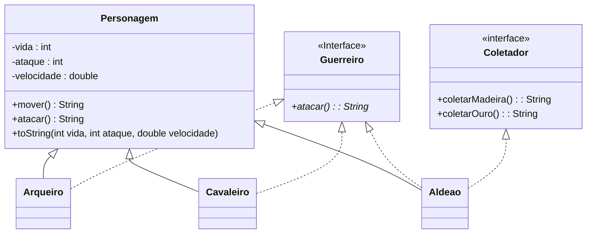

```mermaid
classDiagram
    direction BT

class Personagem{
    -vida : int
    -ataque : int
    -velocidade : double
    +mover() String
    +atacar() String
    +toString(int vida, int ataque, double velocidade)
}


class Aldeao
class Arqueiro 
class Cavaleiro
class Guerreiro{
    <<Interface>>
    +atacar()* : String
}
class Coletador{ 
    <<interface>>
    +coletarMadeira() : String
    +coletarOuro() : String
}


Aldeao --|> Personagem
Arqueiro --|> Personagem
Cavaleiro --|> Personagem

Cavaleiro ..|> Guerreiro
Arqueiro ..|> Guerreiro 
Aldeao ..|> Guerreiro

Aldeao ..|> Coletador


```