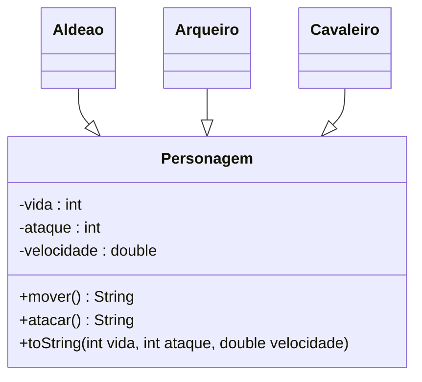

```mermaid
classDiagram

class Personagem{
    -vida : int
    -ataque : int
    -velocidade : double
    +mover() String
    +atacar() String
    +toString(int vida, int ataque, double velocidade)
    
    
}
class Aldeao
class Arqueiro 
class Cavaleiro


Aldeao --|> Personagem
Arqueiro --|> Personagem
Cavaleiro --|> Personagem


```