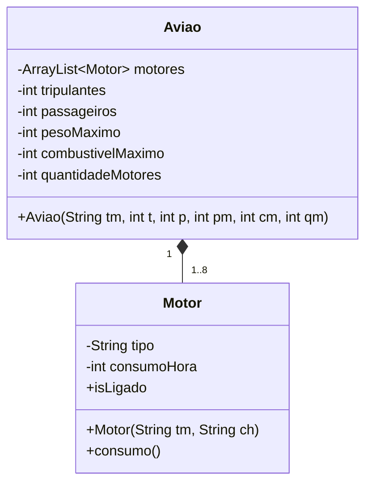

# Teste

## avião 

```mermaid 
classDiagram

    class Aviao{
        -ArrayList~Motor~ motores
        -int tripulantes
        -int passageiros
        -int pesoMaximo
        -int combustivelMaximo
        -int quantidadeMotores
        +Aviao(String tm, int t, int p, int pm, int cm, int qm)
    }
    
    class Motor{
        -String tipo
        -int consumoHora
        +isLigado
        +Motor(String tm, String ch)
        +consumo()
        
        
    }

    Aviao "1" *-- "1..8" Motor


```
