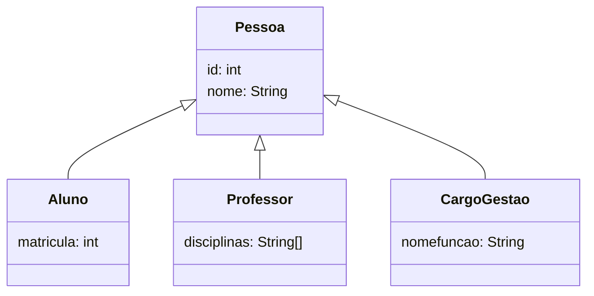
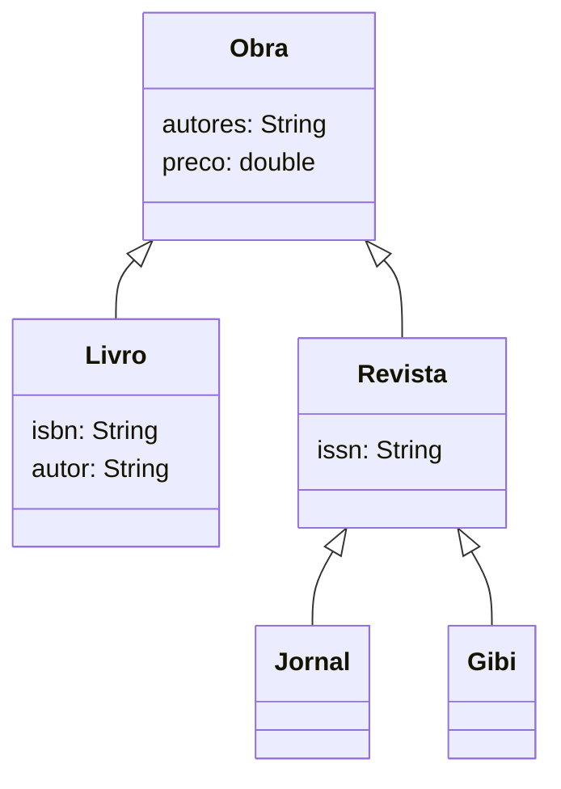
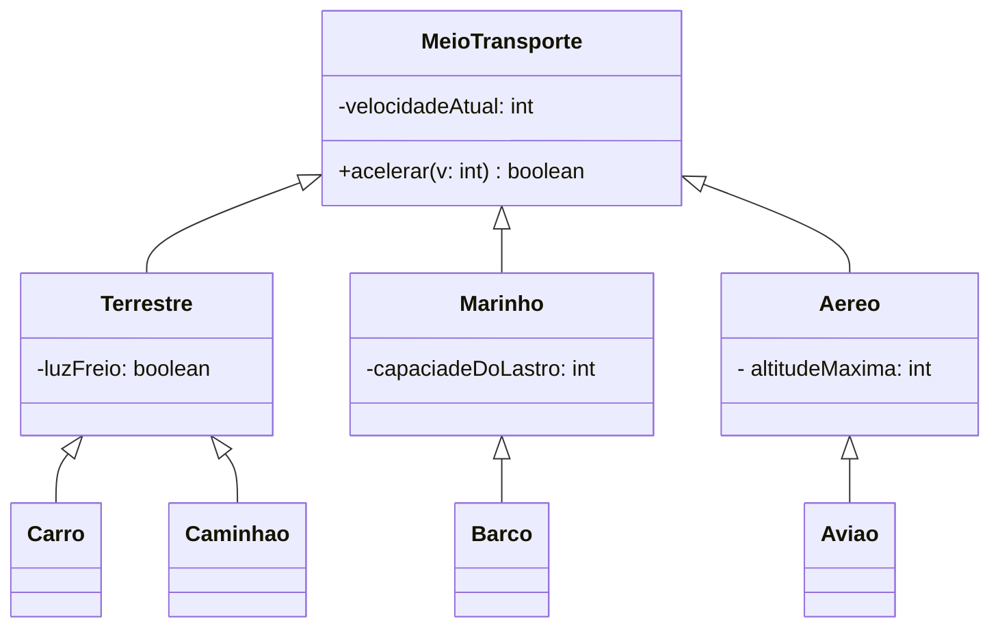
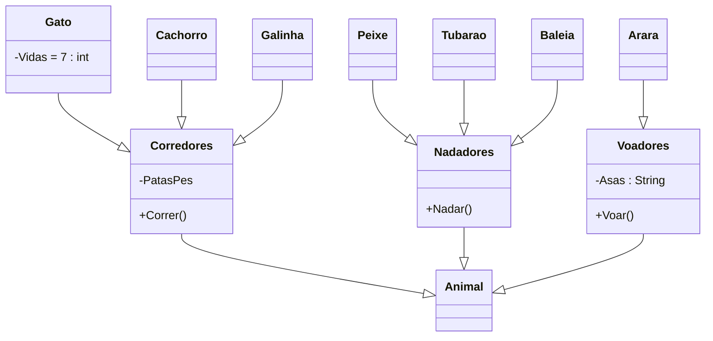

## Exercicio Herança

```mermaid
classDiagram
    
    class Aluno{
        matricula: int
    }
    class Professor{
        disciplinas: String[]
    }
    class CargoGestao{
        nomefuncao: String
    }
    
    class Pessoa{
        id: int
        nome: String
    }
    
    Pessoa<|--Aluno
    Pessoa<|--Professor
    Pessoa<|--CargoGestao
```

```mermaid
classDiagram
    
    class Livro{
        isbn: String
        autor: String
    }
    
    class Revista{
        issn: String
    }
    class Jornal
    class Gibi
    
    class Obra{
        autores: String
        preco: double
    }
    
    Obra <|--Livro
    Obra<|--Revista
    Revista <|-- Jornal
    Revista<|--Gibi
```

```mermaid
classDiagram
    
    class MeioTransporte{
        -velocidadeAtual: int
        +acelerar(v: int) boolean
        
    }
    
    class Terrestre{
        -luzFreio: boolean
    }
    
    class Marinho{
        -capaciadeDoLastro: int
    }
    
    class Aereo{
        - altitudeMaxima: int
    }
    
    class Carro{
        
    }
    
    class Caminhao{
        
    }
    
    class Barco{
        
    }
    
    class Aviao{
        
    }
    
    MeioTransporte<|--Terrestre
    MeioTransporte<|--Marinho
    MeioTransporte<|--Aereo
    Terrestre<|--Carro
    Terrestre<|--Caminhao
    Marinho<|--Barco
    Aereo<|--Aviao

```

```mermaid
classDiagram
    
    class Animal
    class Corredores{
        -PatasPes
        +Correr()
    } 
    class Nadadores {
        +Nadar()
    }
    class Voadores {
        -Asas : String
        +Voar()
    }
    class Peixe
    class Gato {
        -Vidas = 7 : int
    }
    class Cachorro
    class Arara
    class Galinha
    class Baleia
    class Tubarao
    
    Corredores --|> Animal
    Nadadores --|> Animal 
    Voadores --|> Animal 
    
    Peixe --|> Nadadores 
    Tubarao --|> Nadadores 
    Baleia --|> Nadadores
    
    Gato --|> Corredores
    Cachorro --|> Corredores
    Galinha --|> Corredores
    
    Arara --|> Voadores
    
    
    
    
```