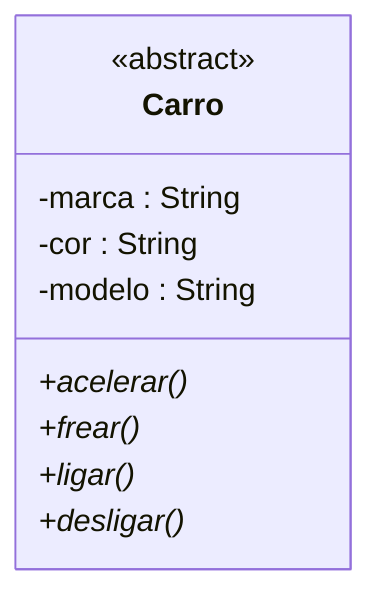

```mermaid
classDiagram
    direction BT

    class Carro{
        <<abstract>>
        -marca : String
        -cor : String
        -modelo : String
        +acelerar()* 
        +frear()*
        +ligar()*
        +desligar()*
    }
    
    


```