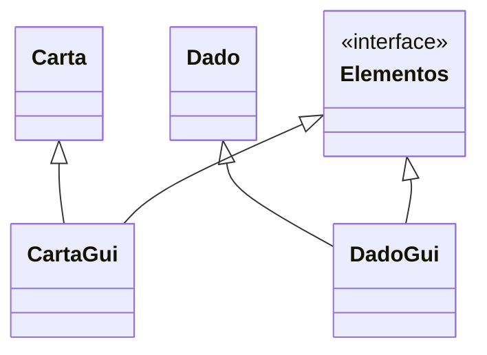

```mermaid 
classDiagram 
    direction TB
    
%%    class App{
%%        
%%    }
%%    class DrawListener{
%%        <<interface>>
%%    }
%%    
%%    class Jogos{
%%        
%%    }
%%
%%    class Dados{
%%        
%%    }
%%
%%    class Cartas{
%%        
%%    }
%%    
%%    class Naipe{
%%        <<enumeration>>
%%    }
%%    
%%    class Valores{
%%        <<enumeration>>
%%    }
%%    
%%    class Grafico{
%%        <<abstract>>
%%    }
%%    
%%    class DadoGui{
%%        
%%    }
%%    
%%    class CartaGui{
%%        
%%    }
%%    
%%    
%%    Jogos *-- Cartas
%%    Jogos *-- Dados
%%    Cartas -- Valores
%%    Cartas -- Naipe
%%    Dados -- Valores
%%    Jogos *-- DrawListener
%%    App *-- Jogos
%%    
%%    Grafico *-- DadoGui
%%    Grafico *-- CartaGui
%%    
%%    
%%    
%%


    class Carta 
    class Dado
    class Elementos{
        <<interface>>
    }
    class DadoGui
    class CartaGui
    

    Carta <|-- CartaGui
    Dado <|-- DadoGui
    Elementos <|-- CartaGui
    Elementos <|-- DadoGui
    
    
```