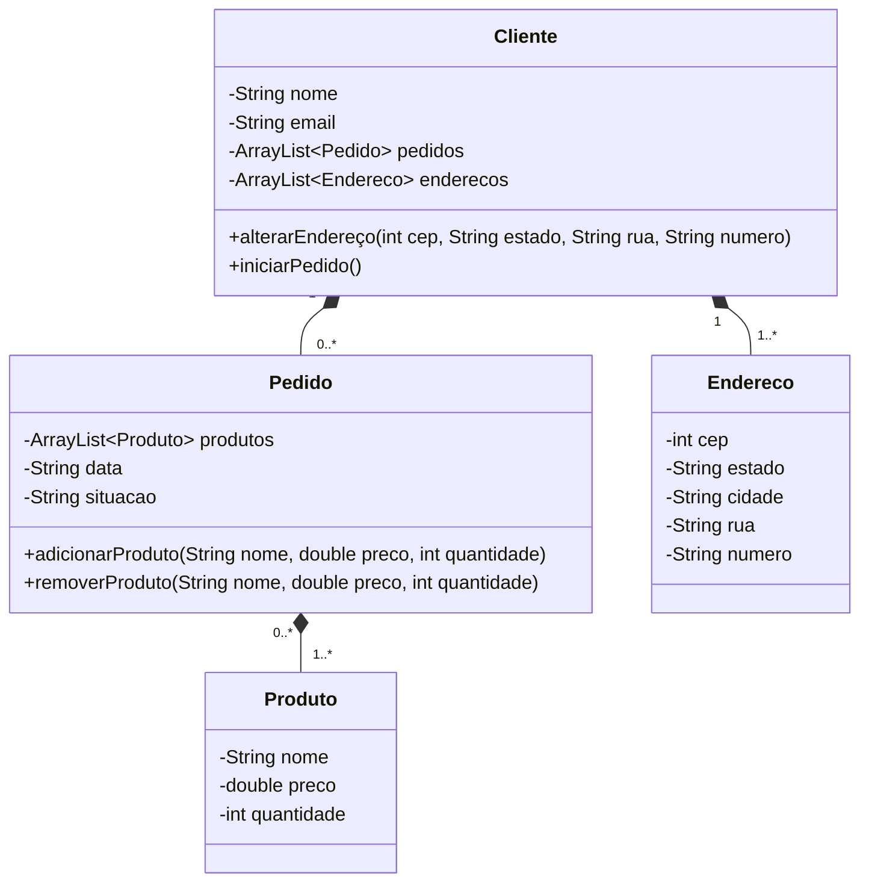

#teste

```mermaid
classDiagram
    

    class Produto{
        -String nome 
        -double preco 
        -int quantidade
        
        
    }

    class Cliente{
        -String nome
        -String email
        -ArrayList~Pedido~ pedidos
        -ArrayList~Endereco~ enderecos
        +alterarEndereço(int cep, String estado, String rua, String numero)
        +iniciarPedido()
        
        
        
    }

    class Pedido{
        -ArrayList~Produto~ produtos
        -String data
        -String situacao
        
        +adicionarProduto(String nome, double preco, int quantidade)
        +removerProduto(String nome, double preco, int quantidade)
        
        

        
    }

    class Endereco{
        -int cep
        -String estado
        -String cidade
        -String rua
        -String numero


        

    }


    Pedido "0..*" *-- "1..*" Produto
    Cliente "1" *-- "0..*"  Pedido
    Cliente "1" *-- "1..*"  Endereco
    


```

