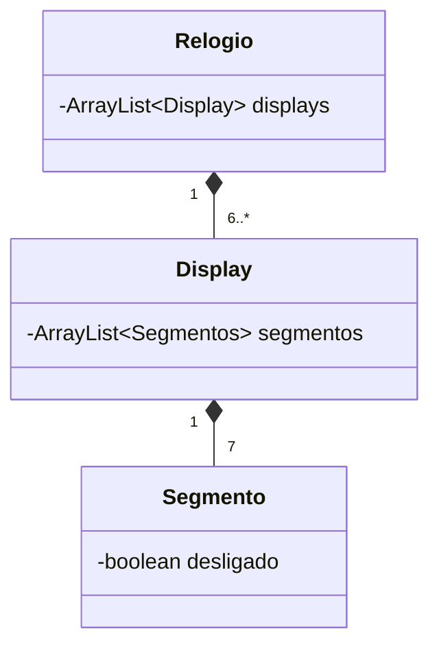

```mermaid
classDiagram
    
    class Relogio{
        -ArrayList~Display~ displays
        
        
        
        
    }


    class Display{
        -ArrayList~Segmentos~ segmentos
        
        
    }


    class Segmento{
        -boolean desligado
        
        
        
    }

    Relogio "1" *-- "6..*" Display
    Display "1" *-- "7" Segmento
    

```