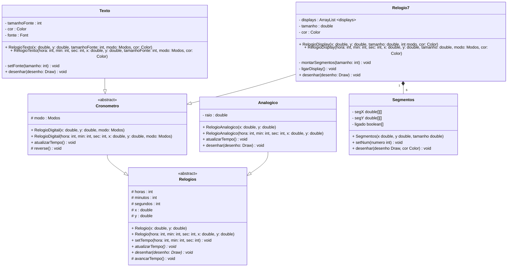

```mermaid
classDiagram

    class Relogios {
        <<abstract>>
        # horas : int
        # minutos : int
        # segundos : int
        # x : double
        # y : double
        + Relogio(x: double, y: double)
        + Relogio(hora: int, min: int, sec: int, x: double, y: double)
        + setTempo(hora: int, min: int, sec: int) void
        + atualizarTempo() void*
        + desenhar(desenho: Draw) void*
        # avancarTempo() void
    }

    class Analogico {
        - raio : double
        + RelogioAnalogico(x: double, y: double)
        + RelogioAnalogico(hora: int, min: int, sec: int, x: double, y: double)
        + atualizarTempo() void
        + desenhar(desenho: Draw) void
    }

    class Cronometro {
        <<abstract>>
        # modo : Modos
        + RelogioDigital(x: double, y: double, modo: Modos)
        + RelogioDigital(hora: int, min: int, sec: int, x: double, y: double, modo: Modos)
        + atualizarTempo() void
        # reverse() void
    }

    class Relogio7 {
        - displays : ArrayList<Segmentos> ~displays~
        - tamanho : double
        - cor : Color
        + RelogioDisplay(x: double, y: double, tamanho: double, int modo, cor: Color)
        + RelogioDisplay(hora: int, min: int, sec: int, x: double, y: double, tamanho: double, modo: Modos, cor: Color)
        - montarSegmentos(tamanho: int) void
        - ligarDisplay() void
        + desenhar(desenho: Draw) void
    }

    class Texto {
        - tamanhoFonte : int
        - cor : Color
        - fonte : Font
        + RelogioTexto(x: double, y: double, tamanhoFonte: int, modo: Modos, cor: Color)
        + RelogioTexto(hora: int, min: int, sec: int, x: double, y: double, tamanhoFonte: int, modo: Modos, cor: Color)
        - setFonte(tamanho: int) void
        + desenhar(desenho: Draw) void
    }

    class Segmentos {
        - segX double[][]
        - segY double[][]
        - ligado boolean[]
        + Segmentos(x double, y double, tamanho double)
        + setNum(numero int) void
        + desenhar(desenho Draw, cor Color) void
    }

    Cronometro --|> Relogios
    Texto      --|> Cronometro
    Relogio7   --|> Cronometro
    Analogico  --|> Relogios

    Relogio7 "1" *-- "6" Segmentos
```