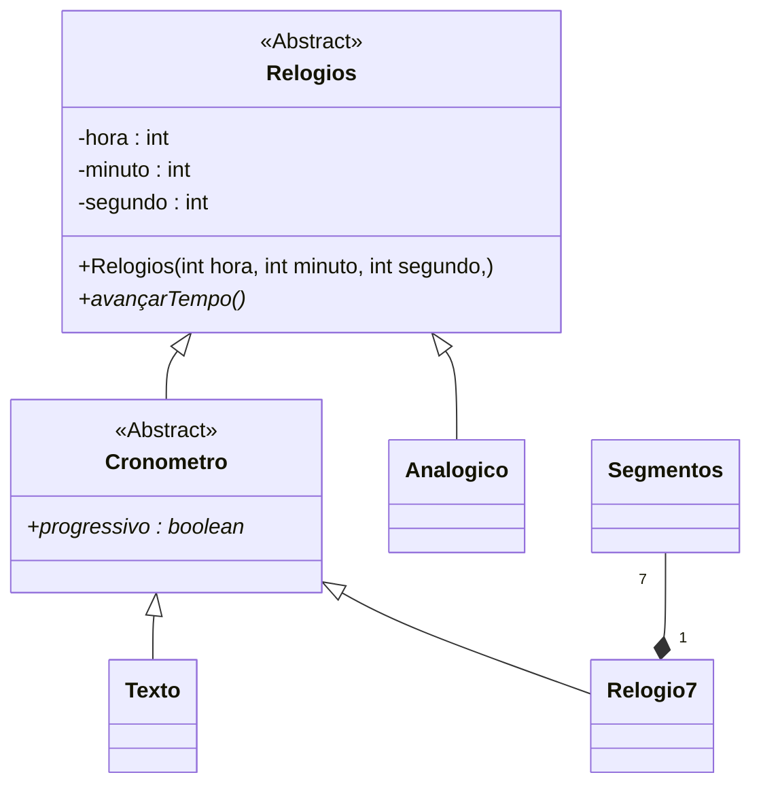

```mermaid
classDiagram
    direction BT

    class Relogios{
        <<Abstract>>
        -hora : int 
        -minuto : int 
        -segundo : int
        +Relogios(int hora, int minuto, int segundo, )
        +avançarTempo()*
    }
    
    class Cronometro{
        <<Abstract>>
        +progressivo : boolean*
    }
    

    class Texto
    class Relogio7
    class Analogico
    class Segmentos
    
    Cronometro --|> Relogios
    
    
    Texto --|> Cronometro
    Relogio7 --|> Cronometro
    
    Analogico --|> Relogios
    
    Relogio7 "1"*-- "7" Segmentos
  
    
    
    
    
    
    
    

```