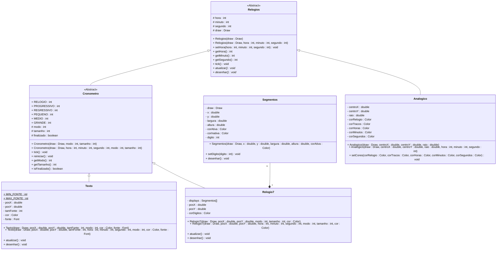

```mermaid
classDiagram
    direction BT

    class Relogios {
        <<Abstract>>
        # hora : int
        # minuto : int
        # segundo : int
        # draw : Draw
        + Relogios(draw : Draw)
        + Relogios(draw : Draw, hora : int, minuto : int, segundo : int)
        + setHora(hora : int, minuto : int, segundo : int) void
        + getHora() int
        + getMinuto() int
        + getSegundo() int
        + tick() void
        + atualizar()* void
        + desenhar()* void
    }

    class Cronometro {
        <<Abstract>>
        + RELOGIO : int
        + PROGRESSIVO : int
        + REGRESSIVO : int
        + PEQUENO : int
        + MEDIO : int
        + GRANDE : int
        # modo : int
        # tamanho : int
        # finalizado : boolean
        + Cronometro(draw : Draw, modo : int, tamanho : int)
        + Cronometro(draw : Draw, hora : int, minuto : int, segundo : int, modo : int, tamanho : int)
        + tick() void
        + reiniciar() void
        + getModo() int
        + getTamanho() int
        + isFinalizado() boolean
    }

    class Relogio7 {
        - displays : Segmentos[]
        - posX : double
        - posY : double
        - corDigitos : Color
        + Relogio7(draw : Draw, posX : double, posY : double, modo : int, tamanho : int, cor : Color)
        + Relogio7(draw : Draw, posX : double, posY : double, hora : int, minuto : int, segundo : int, modo : int, tamanho : int, cor : Color)
        + atualizar() void
        + desenhar() void
    }

    class Segmentos {
        - draw : Draw
        - x : double
        - y : double
        - largura : double
        - altura : double
        - corAtiva : Color
        - corInativa : Color
        - digito : int
        + Segmentos(draw : Draw, x : double, y : double, largura : double, altura : double, corAtiva : Color)
        + setDigito(digito : int) void
        + desenhar() void
    }

    class Texto {
        + MIN_FONTE : int$
        + MAX_FONTE : int$
        - posX : double
        - posY : double
        - tamFonte : int
        - cor : Color
        - fonte : Font
        + Texto(draw : Draw, posX : double, posY : double, tamFonte : int, modo : int, cor : Color, fonte : Font)
        + Texto(draw : Draw, posX : double, posY : double, tamFonte : int, hora : int, minuto : int, segundo : int, modo : int, cor : Color, fonte : Font)
        + atualizar() void
        + desenhar() void
    }

    class Analogico {
        - centroX : double
        - centroY : double
        - raio : double
        - corRelogio : Color
        - corTracos : Color
        - corHoras : Color
        - corMinutos : Color
        - corSegundos : Color
        + Analogico(draw : Draw, centroX : double, centroY : double, raio : double)
        + Analogico(draw : Draw, centroX : double, centroY : double, raio : double, hora : int, minuto : int, segundo : int)
        + setCores(corRelogio : Color, corTracos : Color, corHoras : Color, corMinutos : Color, corSegundos : Color) void
    }


    Cronometro --|> Relogios
    Texto      --|> Cronometro
    Relogio7   --|> Cronometro
    Analogico  --|> Relogios

    Relogio7 "1" *-- "6" Segmentos


```